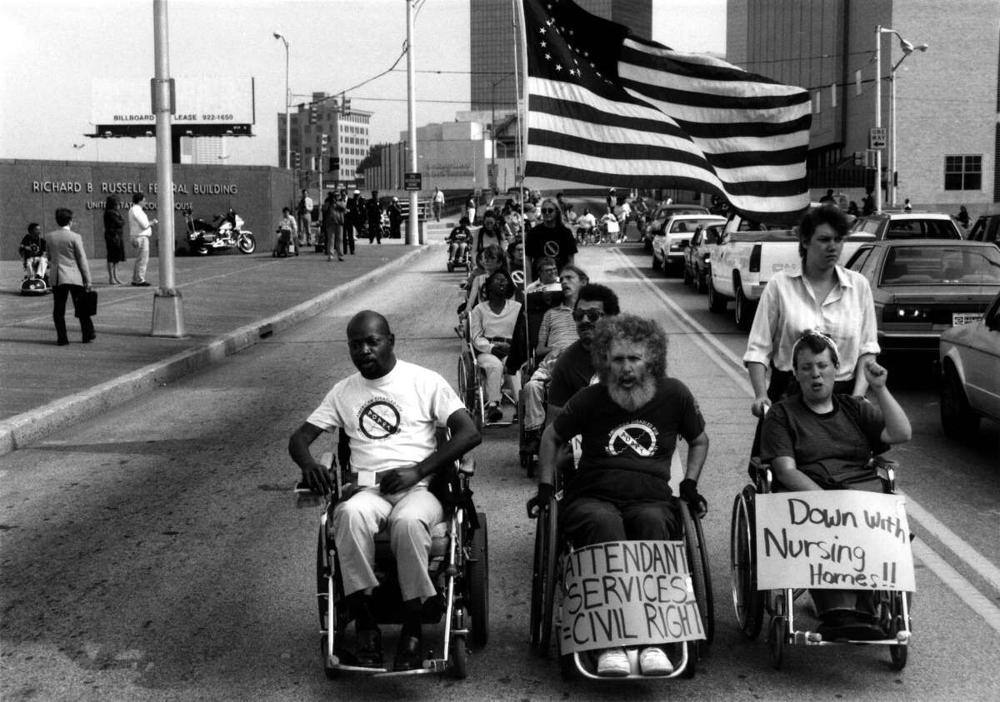

# Dissertation Project

## Body Politic: Disability and Political Cohesion

----

#### Writing Samples and Supplementary Materials

+ [Job Market Paper] 
+ [Secondary Writing Sample]
+ [Center for Political Studies Blog](https://cpsblog.isr.umich.edu/?p=3152)

----

#### Project Summary:
The Centers for Disease Control and Prevention (CDC) estimates that between a fifth and a quarter of Americans lives with some form of functional disability. Disability is an embodied characteristic and a complex social category with clear links to politics. Nevertheless, political scientists have only a superficial understanding of how disability shapes political behavior. In particular, whereas some work considers the impact of disability on political participation, almost no empirical work has examined the implications of disability for political *psychology*. My dissertation addresses this gap by examining whether and to what extent disability shapes political identity and cohesion among disabled Americans.  

Conventional wisdom in public opinion research suggests social identities become politically meaningful through processes of *mobilization*, either from the top-down by political elites, or via grassroots processes of intragroup contact and acculturation ([Egan 2012](https://as.nyu.edu/content/dam/nyu-as/faculty/documents/egan.bjps.2012.pdf)). I argue that these processes are largely inapplicable to disabled Americans. Unlike other social minorities, people with disabilities have not been systematically mobilized by partisan elites, and tend to lack the dense social networks that facilitate political mobilization from the grassroots. Addressing this puzzle, I ask: what social or political processes may contribute to a sense of political solidarity among disabled Americans? 

My dissertation project addresses this question using new theory and data from three original national surveys of American adults with disabilities (total N > 2000) and nationally representative data from the 2024 ANES Pilot Study (N = 583). I argue that even in the absence of conventional mobilization processes, disability may obtain political salience through exposure to ableist stigma and discrimination, and via processes of policy feedback that link disability to specific redistributive rights and entitlements. I find that Disability ID is closely associated with variation in impairment characteristics and experiences of socialization into disability-related social institutions. Moreover, I find that identification with disability is strongly associated with a range of political attitudes and identities, including partisanship, ideological self-placement, and policy preferences. Taken together, these findings provide robust evidence that disability is an important dimension of *political* identification.

----

#### Disability Rights Protesters in Georgia. Photography by Tom Olin.

----
